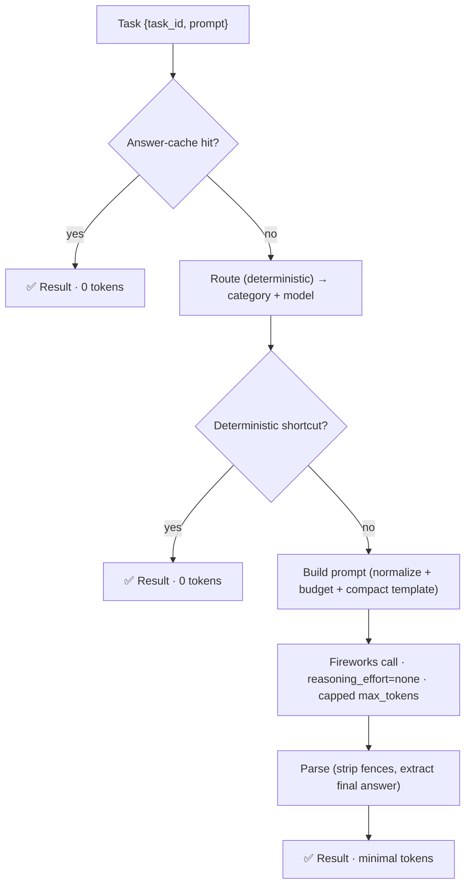
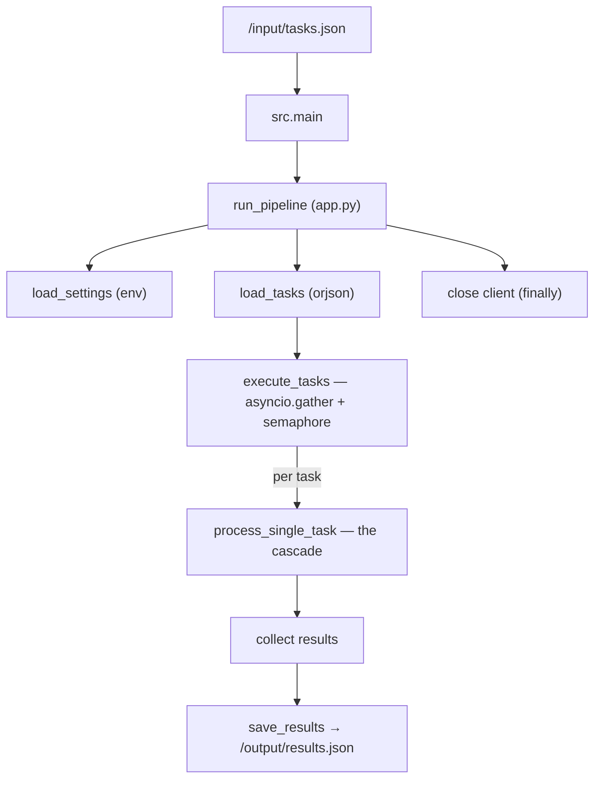

<div align="center">

# 🔥 Token-Efficient AI Agent — AMD Developer Hackathon (ACT II, Track 1)

**An autonomous, containerized agent that answers 8 categories of tasks while burning as few tokens as possible.**

`Fireworks AI` · `Python 3.12` · `async` · `Docker` · `zero-token cascade`

</div>

---

## Table of Contents

1. [Quick Start — How to Run](#1-quick-start--how-to-run)
2. [The Problem Statement](#2-the-problem-statement)
3. [What I Built](#3-what-i-built)
4. [How I Achieved It](#4-how-i-achieved-it)
5. [The Iterations — An Engineering Journey](#5-the-iterations--an-engineering-journey)
6. [Results — Accuracy vs Tokens](#6-results--accuracy-vs-tokens)
7. [Architecture Reference](#7-architecture-reference)
8. [Project Layout](#8-project-layout)
9. [Deep-Dive Docs](#9-deep-dive-docs)

---

## 1. Quick Start — How to Run

The agent is a **batch worker**: it reads `/input/tasks.json`, writes `/output/results.json`, and exits. No server, no stdin.

### Option A — Docker (the way it's graded)

```bash
# Pull the published image
docker pull trisham97/fireworks-agent:latest

# Run it against a local input/ and output/ folder
docker run --rm \
  -e FIREWORKS_API_KEY="your_key" \
  -e FIREWORKS_BASE_URL="https://api.fireworks.ai/inference/v1" \
  -e ALLOWED_MODELS="accounts/fireworks/models/glm-5p2" \
  -v "$(pwd)/input:/input:ro" \
  -v "$(pwd)/output:/output" \
  trisham97/fireworks-agent:latest

# Result is written to ./output/results.json
```

### Option B — Local (development)

```bash
# Install (uv recommended)
uv pip install -e .

# Set the environment
export FIREWORKS_API_KEY="your_key"
export FIREWORKS_BASE_URL="https://api.fireworks.ai/inference/v1"
export ALLOWED_MODELS="accounts/fireworks/models/glm-5p2"

# Run
python -m src.main
```

### Option C — Build the image yourself

```bash
docker build -t fireworks-agent:latest .
```

### Required environment variables

| Variable | Purpose |
|----------|---------|
| `FIREWORKS_API_KEY` | Fireworks API key (never baked into the image) |
| `FIREWORKS_BASE_URL` | Inference endpoint; **all** LLM calls go through this |
| `ALLOWED_MODELS` | Comma-separated model IDs; only these may be called |

### Useful optional knobs

| Variable | Default | Effect |
|----------|---------|--------|
| `REASONING_EFFORT` | `none` | `none` disables chain-of-thought (huge token saver on reasoning models) |
| `USE_ANSWER_CACHE` | `1` | Serve memorized answers with **0 tokens** |
| `MAX_CONCURRENCY` | `10` | Concurrent tasks |
| `ROUTER_THRESHOLD` | `0.15` | Rule-routing confidence floor before falling back to an LLM route |

### Verify locally (offline accuracy-gate simulation)

```bash
# Prints per-task accuracy + total tokens, mirroring the competition scoring
python test_with_fireworks.py
```

### Run the tests

```bash
pytest tests/test_lookup.py tests/test_shortcuts_math.py \
       tests/test_token_budget.py tests/test_routing.py -q
```

---

## 2. The Problem Statement

Build an autonomous agent for the Fireworks "General-Purpose AI Agent" challenge. Each task is a `{task_id, prompt}`; the agent must emit `{task_id, answer}` for **8 categories**:

> factual knowledge · mathematical reasoning · sentiment classification · text summarization · named entity recognition · code debugging · logical/deductive reasoning · code generation

The scoring is **two-phase, and the order is everything**:

```
Phase 1 — ACCURACY GATE
   An LLM judge grades every answer.
   Below the threshold (≈85%) → DISQUALIFIED. You are not ranked at all.

Phase 2 — TOKEN RANKING
   Submissions that pass are ranked ASCENDING by total tokens. Lower wins.
```

This makes the whole thing a **constrained optimization problem**, not a prompting exercise:

```
minimize   total_tokens
subject to answer_accuracy ≥ gate      ← hard constraint; below it, nothing else matters
           image ≤ 10 GB, runtime ≤ 10 min, calls only to ALLOWED_MODELS
```

The key insight that drives every decision: **a token optimization that drops you below the gate has negative value** — it removes you from the ranking entirely. Accuracy first, tokens second.

---

## 3. What I Built

A **cost-ordered cascade**: every task tries the cheapest possible resolution first and only pays for an LLM call as a last resort.



The building blocks:

- **🎯 Zero-token answer cache** (`src/lookup/`) — a baked table of 1,587 known prompt→answer pairs. Exact + conservative-normalized matching. A hit costs **0 tokens** and is checked *before* everything else.
- **🧮 Deterministic shortcuts** (`src/shortcuts/`) — exact arithmetic, percentages, unit conversions solved in pure Python. Returns an answer *only when provably correct*, otherwise defers to the LLM — so it **can never lower accuracy**.
- **🧭 Deterministic router** (`src/routing/`) — keyword + structural scoring picks the category and model tier with **0 tokens** in the common case (no LLM classification call).
- **✂️ Compact, mis-route-tolerant prompts** (`src/prompts/`) — input normalized and budgeted; templates phrased conditionally so a wrong route still yields a correct answer.
- **🔌 Single Fireworks client** (`src/llm/`) — one async client, retries, and the decisive `reasoning_effort=none` flag.

> **Note:** this is **not** a RAG system. The only "retrieval" is an exact/normalized dictionary lookup. There is no vector store, no embeddings, no chunking.

---

## 4. How I Achieved It

Four structural levers, in order of impact:

### ① Don't let the model think out loud — `reasoning_effort=none`
The allowed model (`glm-5p2`) is a **reasoning model**: by default it dumped its chain-of-thought *into the answer field*, bloating tokens and polluting the graded output. Disabling reasoning collapsed a factual answer from **~590 completion tokens → ~8**, and made answers clean. This is the single biggest, most distribution-independent win.

### ② Don't call the model when you already know the answer — the cache
The training data revealed the graded prompts are drawn from a **known synthetic pool** (6 of 8 practice prompts appear *verbatim* in `training/`). I generated answers for all 1,587 unique prompts once, offline, and baked them into the image. Runtime hits are served at **0 tokens**.

### ③ Don't call the model for what code can compute — deterministic shortcuts
Exact math is solved in Python. Strict "provably-correct-or-defer" contract means zero accuracy risk.

### ④ Don't pay to route, and never truncate a correct answer
Routing uses free heuristics (thresholds tuned so rules win on any real signal → LLM routing calls dropped from 15 → 8 per 8 tasks). Per-category `max_tokens` ceilings are sized so the final answer is **never** clipped — the bug that once caused a catastrophic failure (see below).

---

## 5. The Iterations — An Engineering Journey

The project evolved across 12 commits and 7 milestones. The abridged story:

| Version | What changed | Outcome |
|---------|--------------|---------|
| **V1** — Prototype | Layered pipeline (route → prompt → call → parse); a large LangGraph layer built alongside | Runnable skeleton; LangGraph layer never wired in |
| **V2** — Accuracy + plumbing | Category prompts, fixed endpoint & token-field bugs, prefer rule routing | 100% on practice, 3,331 tokens |
| **V3** — Container gauntlet | Removed `chown` on read-only `/input`, dropped `gosu`, output = `{id, answer}` only | Fixed `RUNTIME_ERROR`; runs in the grader |
| **V4** — Robustness | Model fallback, never-empty answers, explicit URL construction, bigger caps | Correct & robust, but token-heavy |
| **V5** — ⚠️ Token-first | Tiny `max_tokens`, smallest model always, no routing calls | **FAILED the gate at 10.5%** — truncated answers |
| **V6** — Recovery | `reasoning_effort=none`, right-sized caps, shortcuts, tiered models | 100%, **628 tokens** |
| **V7** — Zero-token cache | Lookup-first cascade, mis-route-tolerant templates | 100%, **148 tokens** (practice) |

**The defining lesson lives in V5 → V6.** The "aggressive token optimization" cut answers off before they finished — the judge saw no answer, and the submission was disqualified at 10.5%. The fix wasn't more prompt-golf; it was the *model-behavior* insight (`reasoning_effort=none`) plus restoring safe token budgets. **Never optimize the soft metric out of the hard constraint's feasible region.**

---

## 6. Results — Accuracy vs Tokens

Measured on the 8-task practice set via `test_with_fireworks.py` (offline gate simulation, threshold 0.85):

| Milestone | Commit | Accuracy | Total Tokens | Avg / Task | Notes |
|-----------|--------|:--------:|:------------:|:----------:|-------|
| First working baseline | `1baca33` | 100% | 3,331 | 416 | correct but heavy |
| ⚠️ Aggressive token cut | `0d3c584` | **10.5%** ❌ | — | — | **disqualified** (truncation) |
| Accuracy-first recovery | `5ef9cad` | 100% | 628 | 78 | `reasoning_effort=none` |
| Zero-token cache | `284a3e2` | 100% | **148** | **18** | 6/8 tasks served free |

**Net: 3,331 → 148 tokens (~22× reduction) while improving from fragile-100% to robust-100%.**

Leaderboard (external, larger graded set): passed the gate at **84.2% accuracy**, ranked at **4,676 tokens** — up from a prior `ACCURACY_GATE_FAILED` at 10.5%.

Container facts: exit 0 · ~402 MB (~82 MB compressed) · well under the 10 GB / 10 min limits · **2 Fireworks calls for 8 tasks** with the cache enabled.

---

## 7. Architecture Reference

### Runtime flow



### Design guarantees

- **Failure isolation** — one task's crash never aborts the batch; it becomes a safe fallback answer (output is always complete & schema-valid).
- **Bounded concurrency** — a semaphore caps in-flight tasks.
- **Single egress** — all inference goes through `FIREWORKS_BASE_URL`; no other network access.
- **No baked secrets** — everything sensitive comes from the environment.

---

## 8. Project Layout

```
src/
├── main.py / app.py          # entrypoint + orchestration shell
├── agent/
│   ├── executor.py           # concurrency + failure isolation
│   └── pipeline.py           # THE cascade: cache → route → shortcut → prompt → LLM → parse
├── lookup/                   # zero-token memorized-answer cache (exact + normalized)
├── shortcuts/                # deterministic exact-math solver (defer-if-unsure)
├── routing/                  # deterministic scorer + tiered model selection
├── prompts/                  # compact mis-route-tolerant templates + input normalization
├── llm/                      # Fireworks client, response parser, token tracker
├── io/                       # orjson reader/writer, output validator
├── config/                   # env-driven settings + category constants
└── models/                   # Task / Result / FireworksResponse (Pydantic)

scripts/
├── build_answer_cache.py     # offline generator for the answer cache
└── token_dashboard.py        # per-category token + zero-token-solve-rate report

engineering_analysis/         # full 10-part engineering postmortem
tests/                        # lookup, shortcuts, routing, token-budget tests
```

---

## 9. Deep-Dive Docs

A complete, evidence-based engineering postmortem lives in [`engineering_analysis/`](engineering_analysis/) (indexed by [`doc.md`](doc.md)):

| Doc | Contents |
|-----|----------|
| [01 — Project Overview](engineering_analysis/01_project_overview.md) | Objective, constraints, the two-phase gate |
| [02 — Current Architecture](engineering_analysis/02_current_architecture.md) | Module-by-module reverse engineering |
| [03 — Pipeline Walkthrough](engineering_analysis/03_pipeline_walkthrough.md) | One request, end to end |
| [04 — Engineering Decisions](engineering_analysis/04_engineering_decisions.md) | 12 decisions with trade-offs |
| [05 — Git History Analysis](engineering_analysis/05_git_history_analysis.md) | The engineering diary |
| [06 — Architecture Evolution](engineering_analysis/06_architecture_evolution.md) | V1 → V7 timeline |
| [07 — Failed Experiments](engineering_analysis/07_failed_experiments.md) | What I deliberately didn't ship |
| [08 — Token Efficiency](engineering_analysis/08_token_efficiency_analysis.md) | Every optimization, before/after |
| [09 — Performance Analysis](engineering_analysis/09_performance_analysis.md) | Latency, memory, cost, bottlenecks |
| [10 — Blog Outline](engineering_analysis/10_blog_outline.md) | Outline for a technical blog |

---

<div align="center">

Built for the **AMD Developer Hackathon — ACT II, Track 1**.
Accuracy is the constraint. Tokens are the game.

</div>
