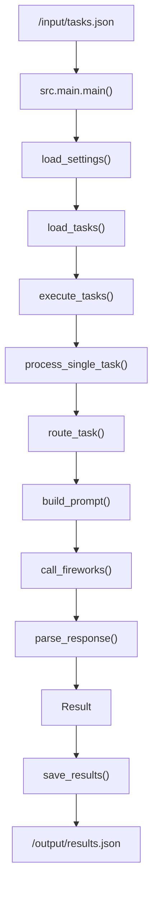
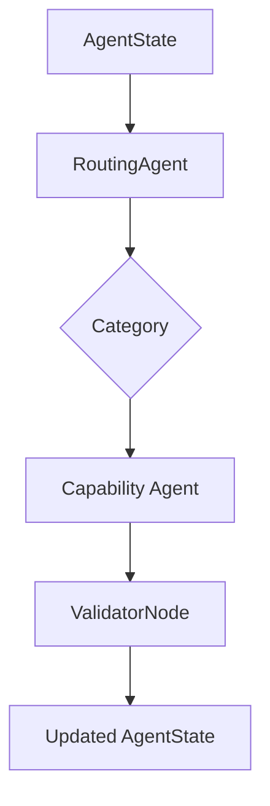
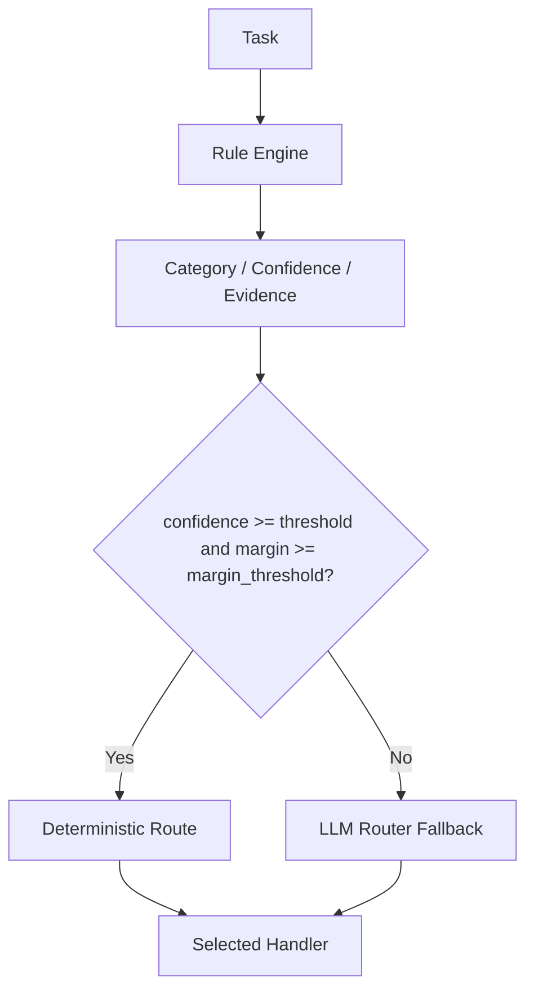
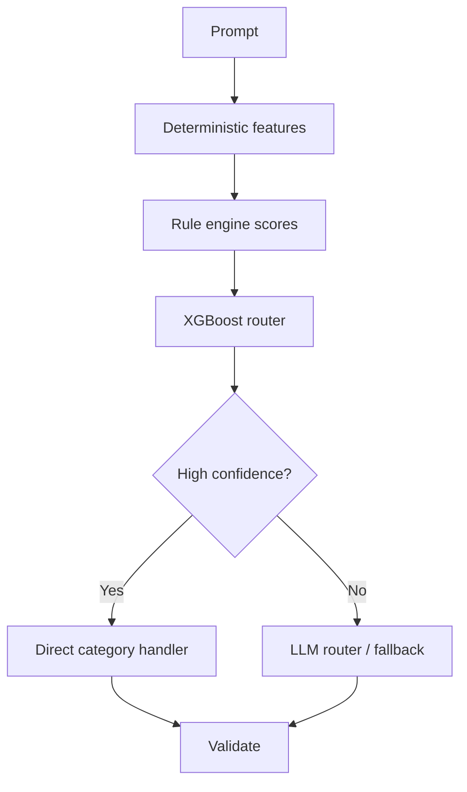

# Architecture Overview

This document explains how the Fireworks AI competition system is structured, how the current agents work, what has been added in this repository, and how the offline "outer" XGBoost router can be trained from synthetic and production-like data.

The system is designed around one main objective:

1. Pass the accuracy gate.
2. Minimize Fireworks token usage after accuracy is acceptable.

The runtime is batch-oriented, not service-oriented:

- Read `/input/tasks.json`
- Process each task
- Write `/output/results.json`
- Exit successfully

There is no HTTP server and no always-on daemon.

---

## 1. High-Level Design

The repository now contains two closely related layers:

1. The production batch pipeline that is actually executed by the competition container.
2. The LangGraph-style orchestration layer that contains the capability agents, deterministic routing logic, validators, and offline-learning scaffolding.

The two layers share the same design goals:

- deterministic preprocessing wherever possible
- exactly one Fireworks call when a fallback is needed
- strict validation after model output
- small prompts
- traceable execution metadata

### End-to-end batch path

### Capability-layer path

The batch path is the competition entrypoint today. The capability layer is where the richer agent logic lives.

---

## 2. What Has Been Added

The repository now includes the following major additions:

### Orchestration layer

- `src/orchestration/graph.py`
  - LangGraph-compatible graph construction
  - fallback graph implementation if LangGraph is unavailable
  - dependency injection for all category agents
- `src/orchestration/state/agent_state.py`
  - typed shared state for routing, prompt templates, outputs, errors, token usage, and metadata
- `src/orchestration/nodes/routing_agent.py`
  - deterministic confidence-based router with rule scoring and evidence tracking
- `src/orchestration/nodes/validator.py`
  - post-node validation hook

### New or expanded capability agents

- `src/orchestration/mathematical_reasoning/`
  - classifier
  - parser
  - solvers
  - validators
  - guardrails
  - Fireworks fallback logic
- `src/orchestration/code_debugging/`
  - parser
  - static analysis integration
  - bug detector registry
  - confidence aggregator
  - repair loop
- `src/orchestration/logical_reasoning/`
  - constraint extraction
  - solver registry
  - validation
  - repair loop
- `src/orchestration/text_summarization/`
  - normalizer
  - constraint extractor
  - document analyzer
  - summarization validator
  - repair loop
- `src/orchestration/code_generation/`
  - language detection
  - complexity detection
  - spec extraction
  - prompt builder
  - validation and formatter

### Offline learning scaffold

- `src/orchestration/offline_learning/`
  - dataset builder
  - deterministic feature engineering
  - training stub
  - evaluation stub
  - model registry
  - pipeline orchestration

### Runtime model selection

- `src/orchestration/runtime/model_selection.py`
  - parses model identifiers
  - infers model family / parameter count / capability hints
  - selects the smallest compatible allowed model

### Batch entrypoint and I/O

- `src/main.py`
  - application entrypoint
  - async execution wrapper
- `src/app.py`
  - loads tasks
  - executes pipeline
  - writes results
  - closes the Fireworks client
- `src/io/reader.py`
  - reads `/input/tasks.json`
- `src/io/writer.py`
  - writes `/output/results.json`

### Production Docker infrastructure

- `Dockerfile`
- `docker-compose.yml`
- `docker-compose.prod.yml`
- `docker/entrypoint.sh`
- `.dockerignore`

### Observability and validation

- token tracking
- node tracing
- structured logging
- guardrails and schema validation

---

## 3. Runtime Contract

The competition contract is simple and strict:

- input comes from `/input/tasks.json`
- output goes to `/output/results.json`
- the process exits after writing the file
- only Fireworks is allowed for remote inference
- secrets must come from the runtime environment

The runtime is configured through:

- `FIREWORKS_API_KEY`
- `FIREWORKS_BASE_URL`
- `ALLOWED_MODELS`
- optional tuning variables such as `MAX_CONCURRENCY`, `TIMEOUT`, `ROUTER_THRESHOLD`, `ROUTER_MARGIN_THRESHOLD`, `ROUTER_MAX_TOKENS`, and `CLIENT_RETRIES`

The code path is intentionally stateless. Every task should be handled independently.

---

## 4. Batch Pipeline Behavior

The production batch pipeline currently runs through these steps:

1. `src.main.main()`
2. `src.app.run_pipeline()`
3. `load_settings()`
4. `load_tasks(Path("/input/tasks.json"))`
5. `execute_tasks(tasks, settings)`
6. `process_single_task(task, settings)`
7. `route_task(task, settings)`
8. `build_prompt(task, routing_decision)`
9. `call_fireworks(prompt, model, settings)`
10. `parse_response(response, category)`
11. `save_results(results, Path("/output/results.json"))`
12. `close_fireworks_client()`

The executor runs tasks concurrently with an asyncio semaphore so that concurrency stays bounded.

### Why this is important

This design keeps startup simple and fast:

- no web server
- no background worker
- no persistent queue
- no extra coordination service

It also makes failure behavior easy to reason about:

- one failing task does not stop the batch
- failures are captured as result metadata
- all results are written before exit

---

## 5. Router Design

There are two routing layers in the repository:

1. The batch pipeline router in `src/routing/router.py`
2. The LangGraph node router in `src/orchestration/nodes/routing_agent.py`

Both are deterministic and confidence-based. They are similar in philosophy but used in different parts of the codebase.

### 5.1 Confidence-based hierarchical routing

The router does not use a binary "heuristics or LLM" switch. It accumulates evidence per category and computes:

- category scores
- winner category
- runner-up category
- margin between top two scores
- routing evidence

Routing then follows:

### 5.2 What the router scores

The router uses lightweight lexical and structural signals such as:

- keywords
- phrases
- code fences
- JSON-shaped inputs
- math operators and digits
- long text hints for summarization
- logic keywords
- debugging terms

The output is not just a category label. It includes:

- confidence
- evidence
- scores for every category
- selected model
- model metadata
- route source
- margin

This is valuable because ambiguous cases can be detected cheaply without a model call.

### 5.3 Why the margin matters

A winner score alone is not enough. Two examples:

- `math=0.48`, `summary=0.46` means the router is uncertain.
- `math=0.82`, `summary=0.10` means the router is highly confident.

The margin gives a better estimate of ambiguity than a single threshold does.

### 5.4 Model selection

Model selection is constrained by `ALLOWED_MODELS`. The runtime parses model names, estimates parameter counts, and chooses the smallest compatible model first.

Current behavior includes:

- parsing `1.7B`, `3B`, `4B`, `7B`, `8x7B`, and similar model identifiers
- inferring rough capability hints such as reasoning or vision support
- selecting the smallest allowed model that still satisfies the task requirements

This is important because token efficiency is only one part of the competition objective. Smaller models often reduce latency and cost while still passing the accuracy gate for simpler categories.

---

## 6. Capability Agents

Each category agent has a narrow responsibility. The guiding principle is that each component should do one thing well.

### 6.1 Factual knowledge

Files:

- `src/orchestration/factual_knowledge/`
- `src/orchestration/category/factual_agent.py`

Behavior:

- builds a compact factual prompt
- can optionally accept a web search tool
- validates input and output through guardrails
- emits structured metadata

This agent is intentionally simple and prompt-driven.

### 6.2 Text summarization

Files:

- `src/orchestration/text_summarization/`
- `src/orchestration/category/summarization_agent.py`

Behavior:

- normalizes whitespace and blank lines
- counts words, sentences, paragraphs
- extracts output constraints such as:
  - one sentence
  - fixed word limit
  - bullets
  - paragraph
  - JSON
  - markdown
- analyzes document size and language hints
- builds a small summary prompt
- validates output deterministically
- allows one repair attempt if validation fails

This is one of the most deterministic agents in the system. The LLM only performs summarization.

### 6.3 Named entity recognition

Files:

- `src/orchestration/category/ner_agent.py`

Current state:

- this is currently a pass-through category node in the orchestration graph
- it exists so the 8-category graph is complete and can be extended later

### 6.4 Sentiment classification

Files:

- `src/orchestration/category/sentiment_agent.py`

Current state:

- currently a pass-through category node
- acts as a placeholder for a dedicated sentiment pipeline

### 6.5 Mathematical reasoning

Files:

- `src/orchestration/mathematical_reasoning/`
- `src/orchestration/category/math_agent.py`

Behavior:

- classifies the math problem type
- parses the problem into structured data
- runs deterministic solvers first
- includes specialized solvers such as:
  - arithmetic
  - unit conversion
  - equations
  - geometry
  - statistics
  - probability
  - number theory
  - SymPy-based symbolic solving
- aggregates solver confidence
- validates the deterministic answer
- falls back to Fireworks only if needed
- supports one repair attempt if the fallback answer fails validation

This agent is designed to maximize zero-token solves.

### 6.6 Code debugging

Files:

- `src/orchestration/code_debugging/`
- `src/orchestration/category/code_debugging_agent.py`

Behavior:

- detects language
- parses code
- runs static analysis
- executes a registry of small bug detectors
- aggregates confidence across detectors
- returns deterministic fixes if confidence is high enough
- falls back to Fireworks only when deterministic confidence is insufficient
- validates output by reparsing / rechecking
- allows a single repair attempt

This is effectively compiler-style debugging rather than conversational debugging.

### 6.7 Logical reasoning

Files:

- `src/orchestration/logical_reasoning/`
- `src/orchestration/category/logical_reasoning_agent.py`

Behavior:

- extracts reasoning constraints
- runs deterministic solvers
- aggregates solver confidence
- validates the answer
- falls back to Fireworks only if necessary
- allows a single repair attempt

### 6.8 Code generation

Files:

- `src/orchestration/code_generation/`
- `src/orchestration/category/code_generation_agent.py`

Behavior:

- detects programming language
- estimates request complexity
- extracts a compact spec
- generates one prompt
- performs one Fireworks call
- validates syntax and formatting
- performs a single repair attempt if validation fails

This agent intentionally avoids planner/executor multi-call designs in the common case.

### 6.9 Summary of category maturity

The capability layer is not uniform by design:

- summarization, math, debugging, logic, and code generation have richer deterministic pipelines
- factual knowledge has a compact prompt-first implementation
- sentiment and NER are currently lightweight placeholders in the graph, ready for future specialized logic

That asymmetry is acceptable because different categories benefit from different levels of deterministic preprocessing.

---

## 7. Validation and Guardrails

Validation is a first-class stage, not an afterthought.

The general pattern is:

1. validate input
2. build deterministic state
3. generate or solve
4. validate output
5. optionally repair once
6. return

Validation is specific to each category:

- summarization: word count, sentence count, bullets, JSON, paragraph structure
- math: numeric or symbolic correctness, unit consistency, equation correctness
- debugging: syntax, parser, linter, static analysis, formatter
- logic: answer consistency and non-empty constraints
- code generation: syntax, formatting, spec alignment

Guardrails are used to prevent malformed inputs and outputs from propagating into the final result.

### Why validation matters

Validation prevents wasted token loops:

- if deterministic output already passes, return immediately
- if the first LLM output is invalid, repair once
- do not retry indefinitely

This keeps latency and token usage under control.

---

## 8. Observability

The system records structured runtime metadata such as:

- selected category
- selected agent
- selected model
- route source
- confidence
- evidence
- solver or detector identity
- repair attempts
- token usage
- latency

There is also tracing support for nodes and token tracking so that routing decisions and category execution can be analyzed later.

This is useful for:

- debugging routing mistakes
- measuring token efficiency
- comparing deterministic solves vs Fireworks fallback
- building training datasets from runtime logs

---

## 9. Fireworks Client

The Fireworks client is isolated in `src/llm/client.py`.

Important properties:

- asynchronous
- shared `httpx.AsyncClient`
- retries on transient status codes
- latency measurement
- token usage extraction
- base URL comes from runtime settings
- no hardcoded endpoint

This isolation matters because:

- it limits the blast radius of remote calls
- it makes testing simpler
- it enforces the rule that only one module talks to Fireworks directly

The client is also configured to close cleanly at the end of the batch run.

---

## 10. Offline Learning and the Outer XGBoost Router

The offline-learning layer exists to support a future or external meta-router, especially an XGBoost-based router trained on synthetic and logged data.

Current files:

- `src/orchestration/offline_learning/dataset.py`
- `src/orchestration/offline_learning/features.py`
- `src/orchestration/offline_learning/training.py`
- `src/orchestration/offline_learning/evaluation.py`
- `src/orchestration/offline_learning/registry.py`
- `src/orchestration/offline_learning/pipeline.py`

### Important clarification

This layer is a scaffold and training substrate. It is not yet the runtime inference path.

That means:

- runtime tasks are not currently routed through XGBoost
- XGBoost training is isolated from production inference
- the training pipeline can evolve independently of the batch executor

### What the scaffold already provides

- JSONL dataset building
- deterministic feature extraction
- model registry persistence
- training and evaluation adapters
- a pipeline object that can orchestrate all of the above

### What the outer XGBoost router is for

The outer XGBoost router can learn:

- which category a prompt belongs to
- when the rule engine is likely wrong
- which prompts are ambiguous and should fall back to the LLM router
- potentially which model tier should be selected

In practice, it acts as a meta-classifier above the deterministic heuristics.

---

## 11. How to Train the Outer XGBoost Router

The most important principle for training is this:

**train on high-quality labeled routing data, not only on live failures.**

That means synthetic data is extremely valuable.

### 11.1 Training objective

The outer router should learn to predict:

- the correct task category
- optionally a fallback probability
- optionally a confidence score used for thresholding

The simplest first version is a multiclass classifier.

Recommended objective:

- multiclass soft probability output
- calibrated probabilities after training

### 11.2 Synthetic data sources

You should generate synthetic examples for every category.

For each category, generate many prompt variants:

- short prompts
- long prompts
- direct instructions
- indirect instructions
- paraphrases
- adversarial near-misses
- mixed-domain prompts
- noisy prompts
- prompts with irrelevant distractions

Examples by category:

- factual knowledge:
  - definitions
  - explanations
  - "what is..."
  - "why does..."
- mathematical reasoning:
  - arithmetic
  - percentages
  - fractions
  - equations
  - geometry
  - probability
- sentiment:
  - positive/negative/neutral classification
  - tone detection
  - emotional labeling
- summarization:
  - one-sentence summary
  - bullet summary
  - executive summary
  - short abstractive summary
- NER:
  - entity extraction
  - extract persons / organizations / locations / dates
- code debugging:
  - stack traces
  - syntax errors
  - runtime failures
  - incorrect output fixes
- logical reasoning:
  - if/then inference
  - deduction
  - truth-table style questions
- code generation:
  - write a function
  - implement an algorithm
  - produce a class or script

### 11.3 Synthetic generation strategy

A good synthetic generation pipeline should:

1. start from templates
2. fill slots with varied content
3. paraphrase the generated prompt
4. add perturbations that preserve label
5. add hard negatives from nearby categories

For example:

- a "summarize this article" template should be rewritten in multiple styles
- a code debugging prompt should be generated with and without code fences
- a math prompt should vary symbols, wording, and problem structure

### 11.4 Avoiding synthetic-data traps

Synthetic data can overfit to template language. To reduce that risk:

- vary wording aggressively
- mix topic domains
- include multilingual or code-mixed samples if the competition expects them
- include distractor terms from other categories
- include prompts with ambiguous category boundaries
- keep a held-out set of unseen templates

The goal is for the router to learn structure, not just keywords.

### 11.5 Labeling

For synthetic data, the label is known at generation time.

For logged production data, labels can come from:

- the deterministic router decision
- the selected category agent
- human review
- post-hoc correction

The best dataset uses a mixture of:

- synthetic gold labels
- production labels
- adjudicated ambiguous cases

### 11.6 Feature engineering

The current feature scaffold already includes deterministic prompt features such as:

- prompt length
- word count
- code fence presence
- JSON presence
- number presence
- math symbol presence
- summary keyword presence
- reasoning keyword presence
- code keyword presence

For the outer XGBoost router, expand this with features such as:

- router rule scores per category
- top-two score margin
- entropy of the rule distribution
- code fence count
- JSON parse success
- AST parse success
- sentence count
- paragraph count
- language hints
- punctuation ratios
- digit density
- token count estimates

The most useful features are usually simple, stable, and deterministic.

### 11.7 Train / validation / test split

Do not randomly split only by row if many rows come from the same template family.

Instead:

- split by template family
- split by source family
- hold out paraphrase groups
- hold out some difficult categories entirely in a final challenge set if possible

This prevents leakage where the model memorizes template phrasing instead of learning the category.

### 11.8 Training recipe

A practical starting recipe:

1. Build a large JSONL dataset.
2. Extract features deterministically.
3. Train an XGBoost multiclass classifier.
4. Tune class weights for imbalance.
5. Use early stopping on validation loss or macro F1.
6. Calibrate probabilities.
7. Export the model.
8. Register the model version.

Good defaults:

- maximize macro F1
- also inspect calibration and confusion matrices
- pay special attention to ambiguous categories such as factual vs reasoning, code generation vs code debugging, and summarization vs factual explanation

### 11.9 Confidence calibration

The router should not just output a class. It should also output a calibrated confidence score.

Possible calibration methods:

- isotonic regression
- Platt scaling
- temperature scaling on probabilities

Calibration matters because the runtime threshold determines whether the system uses deterministic routing or falls back to the LLM router.

### 11.10 Threshold selection

The best threshold is not arbitrary.

Tune it using validation data:

- if confidence is too low, the system falls back too often and wastes tokens
- if confidence is too high, the router misroutes more often and hurts accuracy

Evaluate the tradeoff on:

- category accuracy
- fallback rate
- token usage
- margin distribution

### 11.11 How XGBoost should be used in the system

The safest integration pattern is:

This means the deterministic engine remains the first line of defense, while XGBoost becomes a learned meta-router for the ambiguous or expensive cases.

### 11.12 What to store in the training dataset

Each training row should include, at minimum:

- prompt text
- ground truth category
- rule-engine scores
- top-two margin
- confidence
- evidence strings
- route source
- fallback used or not
- token usage if available
- latency if available

If you later train a second-stage model for model selection, store:

- selected model
- model family
- prompt complexity features
- fallback success or failure

### 11.13 Recommended model registry practice

Every trained model should be versioned with:

- feature version
- training data version
- metrics
- calibration metadata
- validation status

Only validated models should be promoted to runtime use.

---

## 12. Current Training Scaffold

The current offline-learning code already supports:

- appending structured training records to JSONL
- transforming prompts into deterministic feature vectors
- a placeholder trainer interface
- a simple evaluator
- filesystem-backed model version registration

That means the repo is already prepared for the following workflow:

1. generate or collect data
2. write examples to JSONL
3. train offline
4. evaluate offline
5. register a version
6. promote the version if it passes checks

The current trainer is intentionally minimal. It should be replaced or extended with a real XGBoost implementation when the training stack is finalized.

---

## 13. Testing Strategy

Testing should cover both deterministic and fallback paths.

### 13.1 Unit tests

Use unit tests for:

- routing keyword and phrase scoring
- margin and threshold handling
- model parsing and smallest-compatible-model selection
- text normalization
- constraint extraction
- document analysis
- math problem classification
- parsing and validation logic
- bug detector aggregation
- logic solver selection
- response parsing

### 13.2 Agent tests

Each major agent should be tested with:

- a deterministic success case
- a validation-failure case
- a fallback case
- a repair case when applicable

### 13.3 Offline-learning tests

Test:

- dataset append behavior
- feature extraction
- training record serialization
- model registry write/read
- evaluator output

### 13.4 Integration tests

Integration tests should verify:

- the batch pipeline can read sample `/input/tasks.json`
- the pipeline writes `/output/results.json`
- the output schema is valid
- all tasks complete without crashing
- concurrency works as expected

### 13.5 Docker tests

Test the container contract:

- image builds successfully
- entrypoint starts automatically
- container reads `/input/tasks.json`
- container writes `/output/results.json`
- container exits with code 0 on success
- runtime does not require an HTTP server
- runtime does not require stdin

### 13.6 Regression tests

Regression tests should protect:

- routing behavior
- fallback behavior
- prompt template compactness
- output schema stability
- no unintended token inflation
- no accidental network calls outside Fireworks

---

## 14. Production Considerations

### 14.1 Security

The container should:

- run as non-root
- avoid baking secrets into the image
- use least privilege
- minimize writable filesystem scope
- avoid unnecessary capabilities
- not expose unused ports

### 14.2 Reliability

The runtime should:

- close the Fireworks client cleanly
- handle individual task failures without crashing the full batch
- validate inputs and outputs
- allow graceful exit after writing results

### 14.3 Performance

The project is optimized around:

- lower token usage
- fewer Fireworks calls
- bounded concurrency
- deterministic preprocessing
- prompt compactness
- minimal image size

### 14.4 Reproducibility

Reproducibility comes from:

- pinned runtime version
- explicit environment variables
- deterministic preprocessing
- model registry versioning
- isolated training artifacts

### 14.5 Maintainability

Maintainability comes from:

- composition over inheritance
- one responsibility per module
- strong typing
- testable agent boundaries
- isolated I/O
- isolated Fireworks client

---

## 15. Current Gaps and Future Work

The repository is in a strong state, but there are still clear next steps.

### Current gaps

- the offline-learning XGBoost trainer is still a scaffold
- sentiment and NER are still lightweight placeholders in the orchestration graph
- the runtime graph is not yet using an online learned XGBoost router
- model selection is deterministic and small-model-first, but not yet a learned policy

### Good future additions

- real XGBoost training implementation
- dataset curation scripts for synthetic generation
- richer category-specific detectors for sentiment and NER
- runtime integration of the trained meta-router behind a feature flag
- better calibration and threshold tuning reports
- benchmark dashboards for token usage and accuracy

---

## 16. Suggested Mental Model

Think of the repository as three layers:

1. **Batch shell**
   - reads and writes the competition files
   - manages process lifecycle
2. **Deterministic core**
   - routing
   - parsing
   - validation
   - model selection
   - deterministic solvers and detectors
3. **LLM fallback**
   - only used when deterministic confidence is not enough
   - always constrained by compact prompts and validation

That structure is what keeps the system competitive:

- it is accurate enough to pass the gate
- it is efficient enough to keep token usage low
- it is modular enough to evolve

---

## 17. Practical Summary

If you want the shortest possible summary of the current architecture:

- The competition runner is a batch worker.
- The router is confidence-based and deterministic.
- The best agents do as much work as possible without the model.
- Fireworks is used only when deterministic paths are insufficient.
- Validation and one-step repair are built into the agents.
- Offline learning is prepared for an outer XGBoost router, but that model is not yet part of runtime inference.
- Synthetic data is the right place to start training the router because it gives you scale, balance, and controllable labels.

That is the architecture the repository is moving toward.
