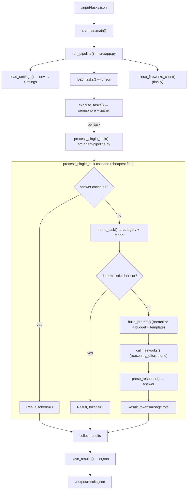

# 02 — Current Architecture (reverse-engineered)

> Evidence base: the live module tree under `src/` at commit `284a3e2` (HEAD).
> Every module below was read directly. Line references are to HEAD.

---

## 2.0 Important framing: what is and isn't in the live system

| Template asks about | Reality in this repo |
|---|---|
| Frontend | **None.** Batch worker, no UI, no HTTP server (`arhictecture.md`). |
| Backend | The batch pipeline: `main → app → executor → pipeline`. |
| LLM | Fireworks chat-completions via one client (`src/llm/client.py`). |
| Prompt pipeline | `src/routing` → `src/prompts` → `src/llm`. |
| Retrieval / Embeddings / Chunking | **Not in the live system.** No vector store, no embeddings, no RAG. The only "retrieval" is an **exact/normalized dictionary lookup** of memorized answers (`src/lookup/`). RAG is reference-only per project owner. |
| Caching | Two zero-token layers: memorized-answer cache (`src/lookup/`) and deterministic shortcuts (`src/shortcuts/`). |
| Evaluation / Scoring | Offline harness `test_with_fireworks.py` (simulates the gate) + `tests/`. The real judge is external. |
| Token accounting | `src/llm/token_tracker.py` + `metadata.tokens` on every `Result`. |
| Context management | Deterministic input normalization + per-category input budget (`src/prompts/normalize.py`). |

So the "retrieval + ranking + embeddings" shape in the deliverable template maps, in
this project, onto a **lookup-first, compute-second, LLM-last** cascade. That cascade
*is* the architecture.

---

## 2.1 Module map (live path only)

```
src/
├── main.py                 # entrypoint: asyncio.run(run_pipeline())
├── app.py                  # orchestrates read → execute → write, closes client
├── agent/
│   ├── executor.py         # asyncio.gather + semaphore; exception → fallback Result
│   └── pipeline.py         # THE cascade: cache → shortcut → route → prompt → LLM → parse
├── lookup/
│   ├── __init__.py         # zero-token memorized-answer cache (exact + normalized)
│   └── answer_cache.json   # 1587 baked prompt→answer entries (583 KB)
├── shortcuts/
│   ├── __init__.py         # category→solver dispatch
│   └── arithmetic.py       # deterministic math (expr, %, unit conversion)
├── routing/
│   └── router.py           # deterministic scorer + tiered model selection + LLM fallback
├── prompts/
│   ├── builder.py          # per-category templates + max_tokens ceilings
│   └── normalize.py        # input normalization + per-category char budget
├── llm/
│   ├── client.py           # httpx async client, retries, reasoning_effort injection
│   ├── parser.py           # strip fences, extract "Answer:" line, compact NER JSON
│   └── token_tracker.py    # global token/latency accumulator
├── io/
│   ├── reader.py           # orjson load, accepts list or {"tasks":[...]}
│   ├── writer.py           # orjson dump of [{task_id, answer}]
│   └── validator.py        # answer-not-None check
├── config/
│   ├── settings.py         # frozen dataclass from env
│   └── constants.py        # the 8 category strings
└── models/
    ├── task.py             # Task (extra="ignore")
    ├── result.py           # Result (frozen, extra="forbid")
    └── response.py         # FireworksResponse, TokenUsage
```

## 2.2 End-to-end control flow



The defining property: **`process_single_task` is a cost-ordered cascade.** Each stage
is strictly cheaper than the next, and each earlier stage can short-circuit the
request. Tokens are spent only when every cheaper stage declines.

## 2.3 Module-by-module detail

### 2.3.1 `main.py` / `app.py` — orchestration shell

`src/main.py` sets up logging and runs `run_pipeline()` inside `asyncio.run`,
translating any exception into exit code 1 (`src/main.py:14-19`). `src/app.py`
sequences `load_settings → load_tasks(/input/tasks.json) → execute_tasks →
save_results(/output/results.json)` and **always** closes the shared HTTP client in a
`finally` (`src/app.py:27-28`). This guarantees the container exits cleanly and no
socket leaks across the batch.

### 2.3.2 `agent/executor.py` — concurrency + failure isolation

```python
semaphore = asyncio.Semaphore(settings.max_concurrency)   # default 10
results = await asyncio.gather(*[...], return_exceptions=True)
```

Two design guarantees (`src/agent/executor.py:15-43`):

- **Bounded concurrency** — a semaphore caps in-flight tasks (default 10) so a large
  batch doesn't open hundreds of sockets or trip provider rate limits.
- **Failure isolation** — `return_exceptions=True` means one task's crash never aborts
  the batch. A failed task becomes a fallback `Result` with answer
  `"I cannot determine the answer to this question."` so the output file is always
  complete and schema-valid. (This behavior was added in `7f7cb8f`; see doc 05.)

### 2.3.3 `agent/pipeline.py` — the cascade (heart of the system)

Order of operations (`src/agent/pipeline.py`):

1. **Answer cache** (`if settings.use_answer_cache`) → `lookup_answer(task.prompt)`.
   Hit → `Result(tokens=0, model="answer_cache")`. Checked *before routing* because
   it's the cheapest possible path.
2. **Route** → `route_task()` returns category + model.
3. **Deterministic shortcut** → `try_shortcut(category, prompt)`. Hit →
   `Result(tokens=0, model="deterministic_shortcut")`.
4. **Build prompt** → `build_prompt()` (normalize + budget + template).
5. **LLM with model fallback** — try routed model, then every other allowed model,
   catching exceptions; first success returns. All fail → `RuntimeError` (caught by
   executor).
6. **Parse** → `parse_response()`.

### 2.3.4 `lookup/` — zero-token memorized-answer cache

`lookup_answer(prompt)` (`src/lookup/__init__.py`) does a two-tier match against a
baked dictionary:

- **Exact** prompt string → answer.
- **Normalized** (`lowercase`, collapse whitespace, strip edge punctuation) → answer,
  with an **ambiguity guard**: if two different-answer prompts share a normalized form,
  the normalized key is disabled (`""`) so it's never served.

The table is loaded lazily and safely — a missing/corrupt file yields an empty cache,
never a crash (`_load` swallows `JSONDecodeError`/`OSError`). This is the closest thing
to "retrieval" in the system, but it is a **dictionary lookup, not vector search**.

### 2.3.5 `shortcuts/` — deterministic zero-token compute

`try_shortcut(category, prompt)` dispatches by category (`src/shortcuts/__init__.py`).
Only `mathematical_reasoning` is wired, to `solve_math` (`src/shortcuts/arithmetic.py`),
which handles three provably-exact shapes:

- bare arithmetic expression (safe AST evaluator, no `eval`),
- `X% of Y`,
- unit conversion (`Fraction`-based, exact).

**Invariant:** it returns an answer *only* when the result is provably correct; on any
ambiguity it returns `None` and defers to the LLM. The dispatcher wraps every solver in
`try/except → None`. This is why the shortcut **can never lower accuracy** — worst case
it's a no-op.

### 2.3.6 `routing/router.py` — deterministic classification + model tiering

Three responsibilities:

1. **`_score_category(prompt)`** — a hand-tuned lexical scorer: keyword weights per
   category plus structural signals (code fence, AST-parseable block, JSON, math
   operators, a strong `<number><op><number>` arithmetic-expression signal, question
   mark). Returns a score vector + evidence.
2. **`_select_handler_model(category, allowed_models, prompt)`** — difficulty-tiered
   selection. `_difficulty_tier` blends the category's base tier with cheap prompt
   features (length, line count, code presence, math density) → tier 0/1/2 → smallest /
   mid / largest model in the size-sorted `ALLOWED_MODELS` pool. Robust to any model
   list (with a single allowed model, all tiers collapse to it).
3. **`route_task`** — takes the rule winner if `confidence ≥ threshold` and
   `margin ≥ margin_threshold` (both tuned per category via `_ROUTE_THRESHOLD_MULT`),
   else makes **one** LLM routing call, wrapped so a failure falls back to the rule
   winner. Thresholds are set low (0.15 / 0.0) so rules win on any real signal —
   eliminating paid routing calls.

### 2.3.7 `prompts/builder.py` + `prompts/normalize.py` — context management

`build_prompt` = `template.format(prompt = prepare_input(task.prompt, category))`
(`src/prompts/builder.py`).

- **`prepare_input`** (`normalize.py`) = `normalize_text` (collapse whitespace/blank
  lines, strip greeting/sign-off filler lines) then `apply_input_budget` (per-category
  char cap; over-budget inputs keep head+tail with a `[content trimmed]` marker).
- **Templates** are ultra-compact and **mis-route-tolerant**: category-specific
  formatting is phrased conditionally ("if this asks for sentiment, reply one word;
  otherwise answer directly") so a wrong route still yields a valid answer.
- **`_MAX_TOKENS`** — per-category output ceilings, sized so the answer never truncates
  but rambling is discouraged. `get_max_tokens(category)` feeds `call_fireworks`.

### 2.3.8 `llm/client.py` — the only Fireworks caller

- **Singleton `httpx.AsyncClient`** keyed on `(api_key, base_url)` for connection reuse
  across the batch.
- **Explicit URL** `base_url.rstrip("/") + "/chat/completions"` (a bug fix; see doc 05,
  `0fac84f`).
- **Retry with backoff** on `{429,500,502,503,504}`.
- **`reasoning_effort` injection** — if `settings.reasoning_effort` is set (default
  `"none"`), it's added to the payload. This is the single biggest token lever: it
  suppresses chain-of-thought on the reasoning model `glm-5p2`.

### 2.3.9 `llm/parser.py` — answer extraction

`parse_response(content, category)`:

- strips code fences;
- for `named_entity_recognition`, if the content is JSON, re-serializes it compactly;
- for `mathematical_reasoning`/`logical_reasoning`, extracts the text after the last
  `Answer:`/`Final answer:` marker (keeps reasoning out of the graded answer);
- otherwise returns the cleaned content.

### 2.3.10 `io/` + `config/` + `models/`

- `reader.py` accepts both `[...]` and `{"tasks":[...]}` (defensive against harness
  format), uses `orjson`, runs off-thread via `asyncio.to_thread`.
- `writer.py` emits exactly `[{task_id, answer}]` — no metadata (competition format;
  see doc 05, `c619b7b`).
- `settings.py` is a frozen dataclass built from env, with the key knobs:
  `reasoning_effort="none"`, `use_answer_cache=True`, `router_threshold=0.15`,
  `router_margin_threshold=0.0`, `max_concurrency=10`.
- `models/task.py` uses `extra="ignore"` (accept unknown fields from the harness);
  `models/result.py` uses `extra="forbid"` + `frozen` (strict output contract).

## 2.4 Token accounting

Two mechanisms:

- **Per-result** — every `Result.metadata["tokens"]` records the tokens that task
  consumed (0 for cache/shortcut hits, `usage.total_tokens` for LLM answers).
- **Global** — `token_tracker.py` accumulates prompt/completion/total tokens and
  latency across all Fireworks calls (used by the offline harness and
  `scripts/token_dashboard.py`, which prints per-category averages and the
  **zero-token solve rate**).

## 2.5 Deployment (container)

Two-stage Dockerfile: a `uv`-based builder installs the package into `/opt/venv`;
the runtime stage copies only the venv + entrypoint. Because
`pyproject.toml` declares `packages = ["src"]` under hatchling, the whole `src`
tree — **including `answer_cache.json`** — is installed into the venv and available at
runtime (verified inside the built image). The entrypoint simply `mkdir /output` and
`exec python -m src.main`. Final image ≈ 402 MB / ~82 MB compressed — far under the
10 GB cap.
