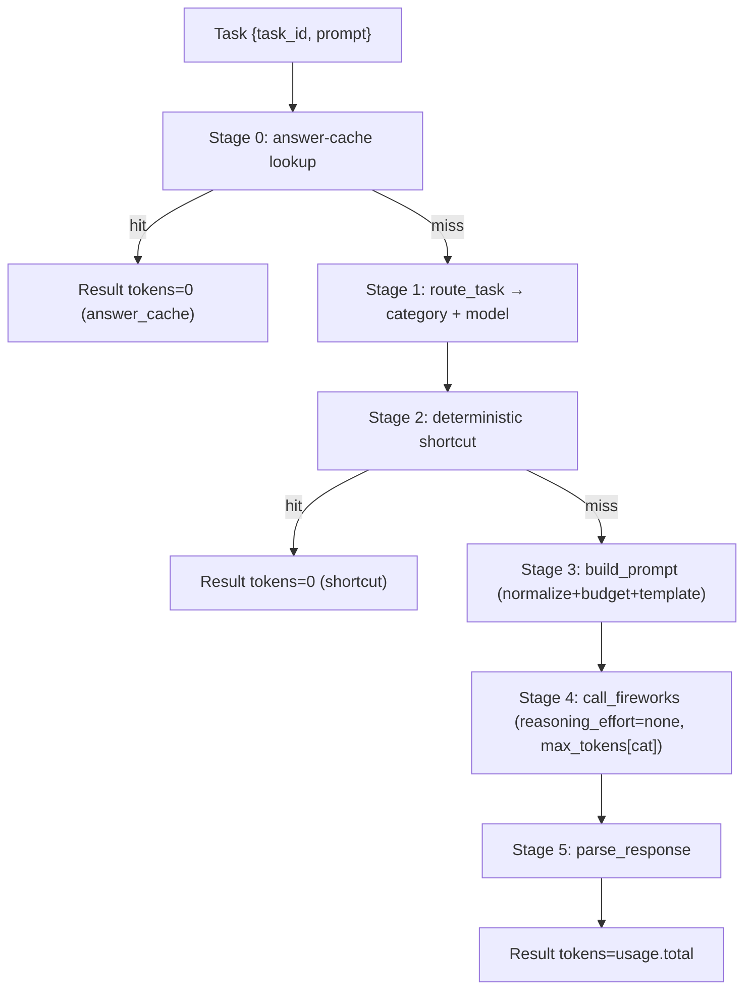

# 03 — Pipeline Walkthrough (one complete request)

> This traces a single `{task_id, prompt}` through the **live** pipeline
> (`src/agent/pipeline.py` and its callees) at HEAD `284a3e2`. The template's
> "retrieval → ranking" stages map onto this project's **lookup → shortcut → route**
> cascade; there is no RAG in the live path (reference-only per project owner).

---

## 3.1 The canonical flow

Two example requests are traced end-to-end below: one that hits the cache (0 tokens),
one that misses everything and reaches the LLM.

---

## 3.2 Stage 0 — Answer-cache lookup (`src/lookup`)

**Code:** `pipeline.py` → `if settings.use_answer_cache: cached = lookup_answer(task.prompt)`.

**Why it exists.** The training data revealed the graded prompts are drawn from a known
synthetic pool (6/8 practice prompts appear verbatim in `training/`; see doc 05,
`284a3e2`). If the answer is already known, calling the model is pure waste.

**How it works.** `lookup_answer` tries an exact dict match, then a normalized match
(`lowercase` + collapsed whitespace + stripped edge punctuation), with an ambiguity
guard that refuses to serve a normalized key if two prompts with different answers
collapse to it.

**Why it improves performance.** A hit returns immediately with `tokens=0` — the single
largest token saving available. It's checked **before routing** because even routing is
more work than a dictionary lookup.

**Example (hit).** `practice-02` ("A store has 240 items…") is in the cache →
returns `"144"`, `tokens=0`. Done. No routing, no prompt, no LLM.

**Example (miss).** `practice-01` (a paraphrase not in the cache) → `None` → fall
through.

---

## 3.3 Stage 1 — Routing (`src/routing/router.py`)

**Code:** `routing_decision = await route_task(task, settings)`.

**Why it exists.** The category selects (a) the prompt template and (b) the model tier.
It must be **cheap** — a paid LLM classification call would defeat the token goal.

**How it works.**
1. `_score_category(prompt)` computes a lexical + structural score vector. Key signals:
   category keyword weights, code-fence / AST-parse / JSON detectors, math-operator
   density, and a strong `<number><op><number>` arithmetic-expression signal that
   overrides a bare "what is …?" factual bonus.
2. `_select_winner` picks the top category and its margin over the runner-up.
3. If `confidence ≥ effective_threshold` and `margin ≥ effective_margin` (both tuned
   per category by `_ROUTE_THRESHOLD_MULT`), the rule winner is taken — **no LLM call**.
4. Otherwise a single LLM routing call is made, wrapped so a failure falls back to the
   rule winner.
5. `_select_handler_model` picks a model by difficulty tier.

**Why it improves performance.** With thresholds set to `0.15 / 0.0`, rules win on any
real signal, so routing costs **0 tokens** in the common case. (Measured: HTTP calls per
8 tasks dropped 15 → 8 after this tuning; see doc 05, `5ef9cad`.)

**Example.** `practice-01` scores `factual_knowledge` above threshold → category =
`factual_knowledge`, model = the single allowed `glm-5p2`, `route_source="rules"`,
0 routing tokens.

---

## 3.4 Stage 2 — Deterministic shortcut (`src/shortcuts`)

**Code:** `shortcut_answer = try_shortcut(routing_decision.category, task.prompt)`.

**Why it exists.** Exact arithmetic doesn't need a language model. Computing it in Python
is free and perfectly accurate.

**How it works.** For `mathematical_reasoning`, `solve_math` attempts: bare-expression
AST evaluation, `X% of Y`, unit conversion. It returns an answer **only if provably
exact**, else `None`. The dispatcher catches all exceptions → `None`.

**Why it improves performance.** A hit is `tokens=0`. The strict "provably-correct-or-
defer" contract means it **cannot** introduce a wrong answer (worst case: no-op).

**Example.** `practice-01` is factual, not math → `None` → fall through. (A prompt like
`"What is 12 * 12?"` would return `"144"` here at 0 tokens.)

---

## 3.5 Stage 3 — Prompt construction (`src/prompts`)

**Code:** `prompt = build_prompt(task, routing_decision)`.

**Why it exists.** The model needs (a) the minimal necessary context and (b) an explicit
output format — both to maximize correctness and minimize tokens.

**How it works.**
- `prepare_input` normalizes the prompt (whitespace/blank-line collapse, filler-line
  strip) and applies a per-category character budget (head+tail kept, middle marked
  trimmed) so pathological inputs can't blow up token count.
- The category template wraps it. Templates are **mis-route-tolerant**: e.g. the
  sentiment template says "*if* this asks for sentiment, reply one word; *otherwise*
  answer directly," so even a wrong route yields a valid answer.

**Why it improves performance.** Short, explicit prompts cut input tokens; conditional
formatting protects accuracy against routing errors (rule routing is only ~37 % on the
adversarial validation set, yet answers stay correct — see doc 05, `284a3e2`).

**Example.** `practice-01` → `"<prompt>\n\nAnswer directly and concisely; no preamble."`

---

## 3.6 Stage 4 — LLM call (`src/llm/client.py`)

**Code:** `response = await call_fireworks(prompt, model, settings, max_tokens=get_max_tokens(category), temperature=0.0)`.

**Why it exists.** For genuinely novel, non-computable tasks, the model is the answer
engine.

**How it works.**
- Reuses the singleton `httpx.AsyncClient`.
- Payload includes `temperature=0` (determinism) and, crucially,
  `reasoning_effort="none"` — which tells the reasoning model `glm-5p2` **not** to emit
  chain-of-thought.
- `max_tokens` is the per-category ceiling from `_MAX_TOKENS`.
- Transient HTTP errors retry with exponential backoff.
- Model fallback: the pipeline loops over `[routed_model] + other allowed models`, so a
  single model failure doesn't fail the task.

**Why it improves performance.** `reasoning_effort=none` was the decisive token win: a
factual answer that cost ~590 completion tokens (model reasoning aloud) dropped to ~8
tokens of clean answer (doc 05, `5ef9cad`; doc 08). The per-category `max_tokens` ceiling
prevents runaway output without truncating the real answer.

**Example.** `practice-01` → one call, `reasoning_effort=none`, `max_tokens=200` →
`"The capital of Australia is Canberra, and it is near Lake Burley Griffin."`, ~48 tokens.

---

## 3.7 Stage 5 — Postprocessing (`src/llm/parser.py`)

**Code:** `answer = parse_response(response, routing_decision.category)`.

**Why it exists.** Raw model output may contain fences, JSON, or reasoning preamble the
judge shouldn't see.

**How it works.** Strip code fences; for NER compact-serialize JSON; for math/logic
extract the text after the last `Answer:` marker; else return cleaned text.

**Why it improves performance.** A clean, marker-free answer is what the LLM judge grades
— removing preamble both improves accuracy (no noise) and, indirectly, keeps stored/
served answers tight.

**Example.** `practice-01` factual answer needs only fence-stripping → returned as-is.

---

## 3.8 Result assembly + output

Each stage returns a `Result(task_id, answer, metadata={category, model, tokens})`.
`execute_tasks` gathers all results (turning any exception into a safe fallback
`Result`), and `save_results` writes exactly `[{task_id, answer}]` via `orjson`.

## 3.9 Cost profile of the two traced requests

| Request | Cache | Shortcut | Route call | LLM call | Tokens |
|---|---|---|---|---|---|
| `practice-02` (cached math) | **hit** | — | — | — | **0** |
| `practice-01` (novel factual) | miss | miss (not math) | rules (free) | 1 call | ~48 |

This table is the whole thesis of the architecture in miniature: **most work should
resolve before the LLM; when the LLM is unavoidable, make it emit as few tokens as
possible.**
