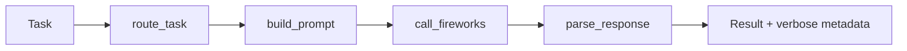
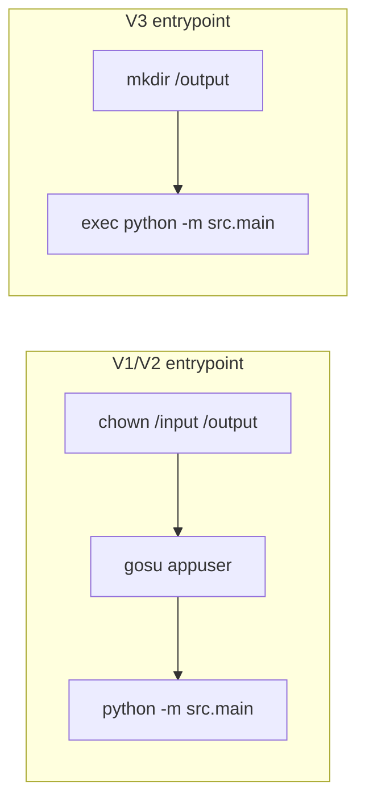
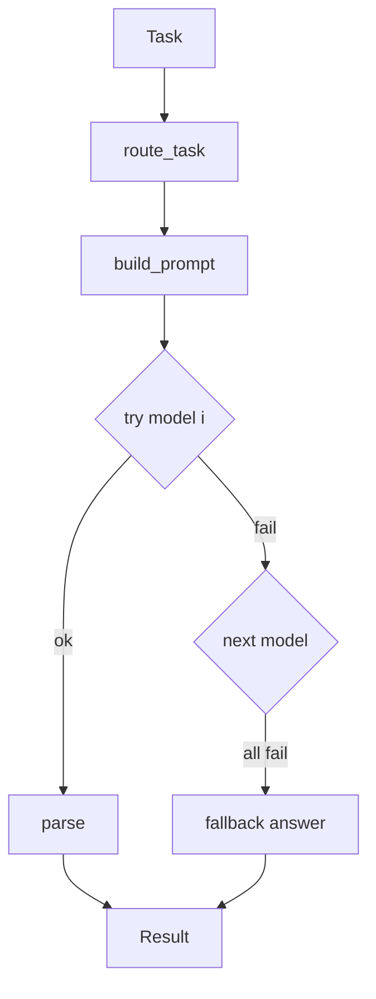
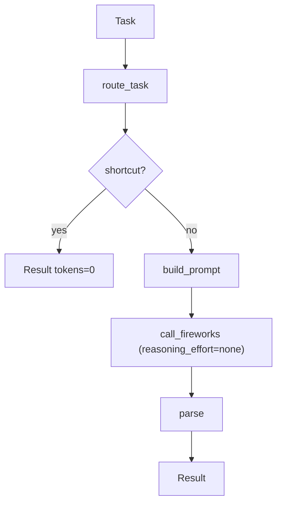
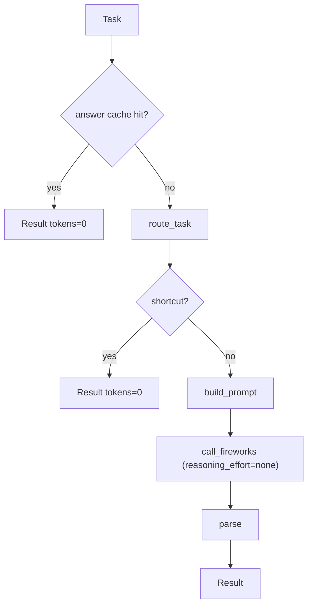

# 06 — Architecture Evolution

> A version-by-version timeline of how the *live* architecture changed and why. Each
> version corresponds to a milestone in `05_git_history_analysis.md`. Diagrams show the
> live request path at each stage.

---

## Timeline

```mermaid
timeline
    title Live pipeline evolution (commits)
    Jul 09 : V1 Initial prototype (535723b) : route→prompt→call→parse, no retry, verbose metadata
    Jul 10 AM : V2 Accuracy + plumbing (491fe8c, 1baca33) : fixed token field, endpoint, prefer rules, 100% practice
    Jul 10 mid-eve : V3 Container hardening (1807155, c619b7b, e5f76ff) : RO input, drop gosu, output {id,answer}
    Jul 10 eve : V4 Robustness (6f5ae63, 0fac84f, 7f7cb8f) : model fallback, never-empty, full-URL, bigger caps
    Jul 10 20:00 : V5 Token-first regression (0d3c584) : tiny caps + smallest model → 10.5% FAIL
    Jul 12 AM : V6 Accuracy-first recovery (5ef9cad) : reasoning_effort=none, shortcuts, tiered models → 628 tok
    Jul 12 PM : V7 Zero-token cache (284a3e2) : lookup-first cascade, mis-route-tolerant → 148 tok practice
```

---

## V1 — Initial prototype (`535723b`)

**Architecture (live path).**

Single LLM call per task, no retry. Verbose metadata in output. `response.tokens_used`
(wrong field). A large `src/orchestration/` layer existed but was never wired in.

**Problem that forced the next version.** Untested against the harness; token field bug
meant accounting was wrong; prompts too generic for reliable accuracy.

---

## V2 — Accuracy + plumbing (`491fe8c`, `1baca33`)

**Change.** Category-specific prompts; fixed endpoint path and token field; set
`max_tokens=512, temperature=0`; lowered router thresholds to prefer deterministic rules.

**Architecture.** Same shape as V1, but correct plumbing and a documented result:
100 % / 3,331 tokens on practice.

**Problem that forced the next version.** It ran locally but **crashed in the competition
container** (filesystem + entrypoint assumptions).

---

## V3 — Container hardening (`1807155`, `c619b7b`, `e5f76ff`)

**Change.** `Task extra="ignore"`; LLM fallback wrapped in try/except; **removed `chown`
on read-only `/input`**; **output reduced to `{task_id, answer}`**; **removed
`gosu`/user-switching** (the `RUNTIME_ERROR` cause); minimal entrypoint.

**Architecture (container).**


**Problem that forced the next version.** Now stable, but accuracy edge cases
(truncation) and an httpx URL-joining bug remained; a single model failure failed a task.

---

## V4 — Robustness (`6f5ae63`, `0fac84f`, `7f7cb8f`)

**Change.** Complete-answer prompts + `max_tokens 512 → 1024`; explicit full-URL
construction; **model fallback loop** + **never-empty fallback answer**; logging.

**Architecture (live path gains a retry/fallback loop).**


**Problem that forced the next version.** Correct and robust, but token count high → the
push to optimize tokens, which triggered the regression.

---

## V5 — Token-first regression (`0d3c584`) ⚠️

**Change.** `max_tokens` slashed (sentiment 30…), 1–3 word prompts, `router_threshold=0`,
**always smallest model**.

**Architecture.** Same shape, but every knob turned toward minimum tokens with no
accuracy guard.

**Problem that forced the next version.** **Accuracy collapsed to 10.5 %
(`ACCURACY_GATE_FAILED`).** Truncated answers + weak model. This is the inflection point
of the whole project.

---

## V6 — Accuracy-first recovery (`5ef9cad`)

**Change (structural).** Introduced the **cost-cascade** shape and the decisive model
setting:
- `reasoning_effort=none` (kills chain-of-thought on `glm-5p2`).
- Deterministic **shortcuts** stage before the LLM.
- Difficulty-tiered model selection.
- Right-sized `max_tokens`; parser extracts `Answer:` line.

**Architecture (cascade emerges).**


**Result.** 100 % / 628 tokens (verified). **Problem that forced the next version.** Still
~1 LLM call per task; top teams reach ~0 tokens.

---

## V7 — Zero-token cache (final) (`284a3e2`)

**Change.** Added the **answer-cache stage before routing** (the cheapest path), and made
templates mis-route-tolerant.

**Architecture (final cascade).**


**Result.** Practice 8/8, 663 → 148 tokens (6/8 free); container 2 HTTP calls per 8
tasks.

---

## What stayed constant vs what changed

| Aspect | V1 | Final |
|---|---|---|
| Core shape | route→prompt→call→parse | **cache→route→shortcut→prompt→call→parse** |
| LLM calls / task | 1 (+ maybe 1 routing) | 0 for known/computable; else 1 |
| Reasoning tokens | uncontrolled | `reasoning_effort=none` |
| max_tokens | one value | per-category ceilings |
| Model choice | (verbose) | difficulty-tiered |
| Output | task_id+answer+metadata | task_id+answer only |
| Container | gosu + appuser | minimal exec |
| Routing trust | strict | low thresholds + mis-route-tolerant templates |

The through-line: the architecture evolved from **"call the model well"** (V1–V4) to
**"avoid calling the model, and when you must, make it cheap and un-truncatable"**
(V6–V7), with V5 as the cautionary detour that proved accuracy is the hard constraint.
